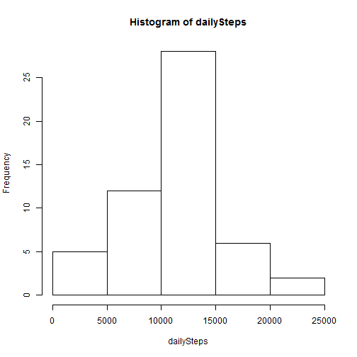

# Reproducible Research: Peer Assessment 1


## Loading and preprocessing the data -- test
1. Unzip the activity.zip
2. Read the activity.csv to data frame - dat
3. Process/Transform the data


```r
dat <- read.csv(unz("activity.zip", "activity.csv"), header = T)
dat[, "date"] <- as.Date(dat[, "date"])
dat[, "date"] <- factor(dat[, "date"])
```


## What is mean total number of steps taken per day?
For this part of the assignment, I ignore the missing values in the dataset.

```r
newDat <- na.omit(dat)
```


**Step 1.** Make a histogram of the total number of steps taken each day  

```r
dailySteps <- tapply(dat[, "steps"], dat[, "date"], sum)
hist(dailySteps)
```

 

**Step 2.** Calculate and report the mean and median total number of steps taken per day  

```r
meanOfSteps <- mean(dailySteps, na.rm = T)
medianOfSteps <- median(dailySteps, na.rm = T)
paste("The mean is:", meanOfSteps, ", and the median is:", medianOfSteps)
```

```
## [1] "The mean is: 10766.1886792453 , and the median is: 10765"
```


## What is the average daily activity pattern?
**Step 1.** Make a time series plot (i.e. type = "l") of the 5-minute interval (x-axis) and the average number of steps taken, averaged across all days (y-axis)  

```r
averageStepsPer5m <- tapply(newDat[, "steps"], newDat[, "interval"], mean)
plot(averageStepsPer5m, type = "l", xlab = "5-minute interval", ylab = "average steps")
```

 


**Step 2.** Retrieve the 5-minute interval which contains the maximum number of steps, on average across all the days in the dataset.

```r
maxAverageStepsPer5m <- max(averageStepsPer5m)
paste("The max number is:", maxAverageStepsPer5m)
```

```
## [1] "The max number is: 206.169811320755"
```


## Imputing missing values
**Step 1.** Calculate and report the total number of missing values in the dataset (i.e. the total number of rows with NAs) 

```r
rowsAll <- nrow(dat)
rowsWithoutNA <- nrow(newDat)
paste("The total number of rows with NAs is ", rowsAll - rowsWithoutNA)
```

```
## [1] "The total number of rows with NAs is  2304"
```

**Step 2.** Fill in all of the missing values with the mean for that 5-minute interval.  
**Step 3.** Create a new dataset that is equal to the original dataset but with the missing data filled in.

```r
datFilledInNAs <- dat
for (i in 1:nrow(dat)) {
    if (is.na(dat[i, 1])) {
        datFilledInNAs[i, 1] = averageStepsPer5m[as.character(dat[i, 3])]
    }
}
```

  
**Step 4.** Make a histogram of the total number of steps taken each day and Calculate and report the mean and median total number of steps taken per day. 

```r
dailySteps <- tapply(datFilledInNAs[, "steps"], datFilledInNAs[, "date"], sum)
hist(dailySteps)
```

 

Q: Do these values differ from the estimates from the first part of the assignment?   
A: Yes.

Q: What is the impact of imputing missing data on the estimates of the total daily number of steps? 
A: I think it increases mean value of the total daily number of steps.

## Are there differences in activity patterns between weekdays and weekends?
**Step 1.** Create a new factor variable in the dataset with two levels � “weekday� and “weekend� indicating whether a given date is a weekday or weekend day.

```r
Sys.setlocale("LC_TIME", "English")
```

```
## [1] "English_United States.1252"
```

```r
week <- weekdays(as.Date(datFilledInNAs[, 2]))
week[which(week %in% c("Saturday", "Sunday"))] = "weekend"
week[which(week %in% c("Monday", "Tuesday", "Wednesday", "Thursday", "Friday"))] = "weekday"
datFilledInNAs <- cbind(datFilledInNAs, week)
datFilledInNAs$week <- factor(datFilledInNAs$week)
```


**Step 2.** Make a panel plot containing a time series plot (i.e. type = "l") of the 5-minute interval (x-axis) and the average number of steps taken, averaged across all weekday days or weekend days (y-axis).

```r
library(lattice)
averageStepsPer5m <- tapply(X = datFilledInNAs$steps, INDEX = list(datFilledInNAs$interval, 
    datFilledInNAs$week), mean)
weekdaySteps <- data.frame(averageStepsPer5m[, "weekday"])
names(weekdaySteps)[1] <- "steps"
weekdaySteps$week <- "weekday"
weekdaySteps$interval <- row.names(weekdaySteps)
weekendSteps <- data.frame(averageStepsPer5m[, "weekend"])
names(weekendSteps)[1] <- "steps"
weekendSteps$week <- "weekend"
weekendSteps$interval <- row.names(weekendSteps)
steps <- rbind(weekendSteps, weekdaySteps)
steps$interval <- as.integer(steps$interval)
xyplot(steps ~ interval | week, data = steps, layout = c(1, 2), type = "l")
```

 

